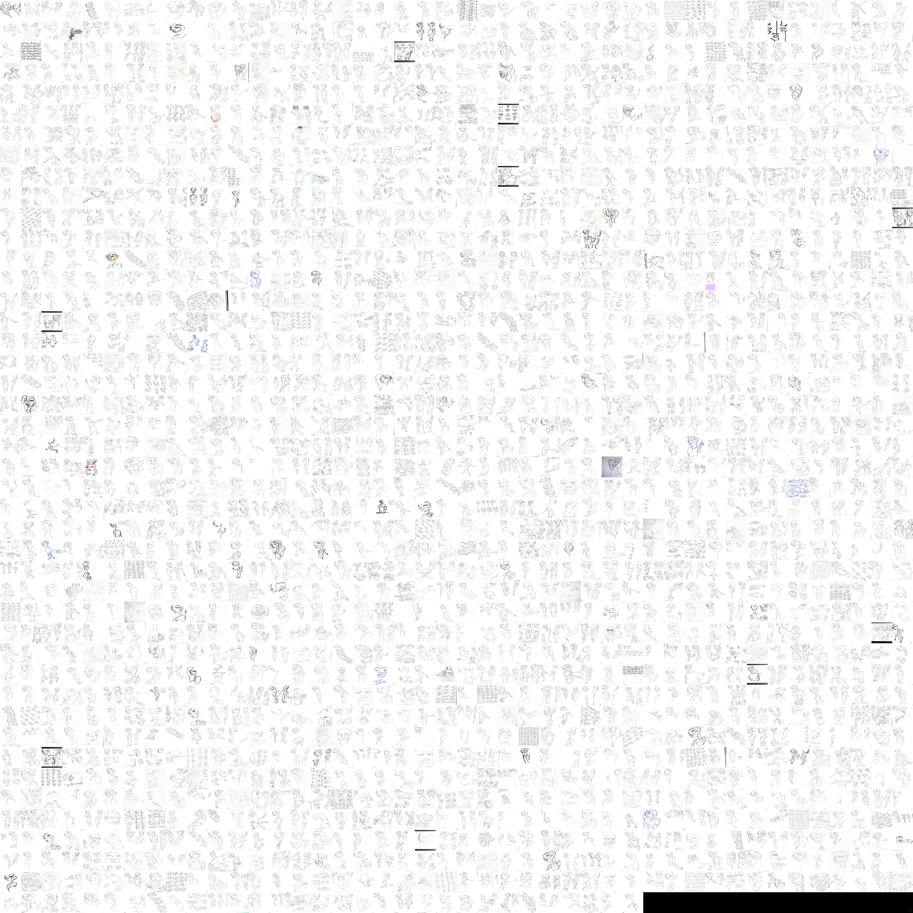

# Portfolio Art - TSNE Embedding Projector

This repository powers an interactive visual embedding browser for my drawing portfolio at [projector.andrewlook.com](http://projector.andrewlook.com).

  

Full image:

## Credits

This repository is based on [harveyslash/TSNE-UMAP-Embedding-Visualisation](https://github.com/harveyslash/TSNE-UMAP-Embedding-Visualisation), which is an easier-to-use version of [Tensorflow's Standalone Embedding Projector](https://github.com/tensorflow/embedding-projector-standalone) with better documentation.

The underlying code (not standalone) lives in the tensorflow repo under [tensorboard/plugins/projector](https://github.com/tensorflow/tensorboard/tree/master/tensorboard/plugins/projector).
