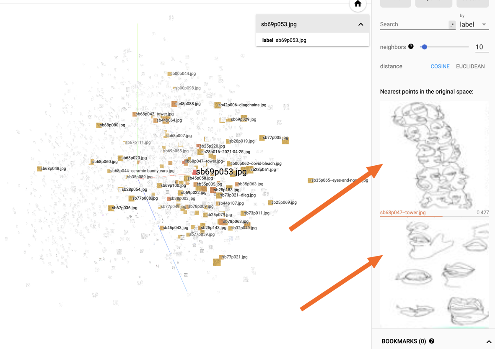

# Portfolio Art - TSNE Embedding Projector

This repository powers an interactive visual embedding browser for my drawing portfolio at [projector.andrewlook.com](http://projector.andrewlook.com).

<p align="center">
  
</p>

This repository is based on [TSNE-UMAP-Embedding-Visualisation](https://github.com/harveyslash/TSNE-UMAP-Embedding-Visualisation) by [Harshvardhan Gupta](https://github.com/harveyslash), which is a better-documented version of [Tensorflow's Standalone Embedding Projector](https://github.com/tensorflow/embedding-projector-standalone). The underlying code (not standalone) lives in the tensorflow repo under [tensorboard/plugins/projector](https://github.com/tensorflow/tensorboard/tree/master/tensorboard/plugins/projector).

I adapted this repo to include my own data, and also to modify the underlying GUI code. Specifically, the image view in the left-hand inspector panel was available in the official tensorboard release inside of [vz-projector-inspector-panel.ts](https://github.com/tensorflow/tensorboard/blob/master/tensorboard/plugins/projector/vz_projector/vz-projector-inspector-panel.ts#L287), but not in the compiled standalone version.



## The Data

It's preloaded with about 1900 single-line drawings scanned from my sketchbooks:


## Repository Structure

```
|-- index.html <-- The GUI of the Viewer
|-- oss_data   <-- published assets used to load data into the GUI
|   |-- oss_demo_projector_config.json        <-- configuration for embedding projector, same format as projector_config.pbtxt
|   |-- sprite.jpeg                           <-- all source images arrayed into a single jpeg
|   `-- feature_vecs.tsv                      <-- tab-delimited embeddings
`-- projector_config.pbtxt                    <-- configuration to run embedding projector via tensorboard CLI (not standalone)
```

## Usage

### Standalone Deployment

From the project root, run the following command and then navigate to `http://localhost:8000`:

```sh
python3 -m http.server
```

### Using Tensorboard CLI

To compare this standalone, hostable version the official tensorboard implementation, run the following and navigate to <http://localhost:6006/#projector>

```sh
pip install -Uqq tensorboard

tensorboard --logdir .
```

## Resources

### Using the Embedding Projector

[Visualizing Data using the Embedding Projector in TensorBoard](https://www.tensorflow.org/tensorboard/tensorboard_projector_plugin) from the official tensorflow documentation gives a helpful introduction, but doesn't cover image sprites.

[Taking the TensorBoard Embedding Projector to the Next Level](https://towardsdatascience.com/taking-the-tensorboard-embedding-projector-to-the-next-level-bde53deb6bb7) by [Ángel Igareta](https://github.com/angeligareta) goes into more depth, specifically covering how to put together the large image sprite.

A stackoverflow answer clarified how to add multiple metadata columns (alongside the label): [python - Tensorboard - Adding multiple metadata labels to data points - Stack Overflow](https://stackoverflow.com/questions/49779136/tensorboard-adding-multiple-metadata-labels-to-data-points).

### Dimensionality Reduction Methods / Clustering

- [How to Use t-SNE Effectively](https://distill.pub/2016/misread-tsne/)
- [How UMAP Works — umap 0.5 documentation](https://umap-learn.readthedocs.io/en/latest/how_umap_works.html)
- [[1802.03426] UMAP: Uniform Manifold Approximation and Projection for Dimension Reduction](https://arxiv.org/abs/1802.03426)
- [machine learning - How to understand the drawbacks of K-means - Cross Validated](https://stats.stackexchange.com/questions/133656/how-to-understand-the-drawbacks-of-k-means)

## Alternative Approaches

## Credits
